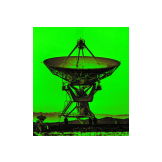
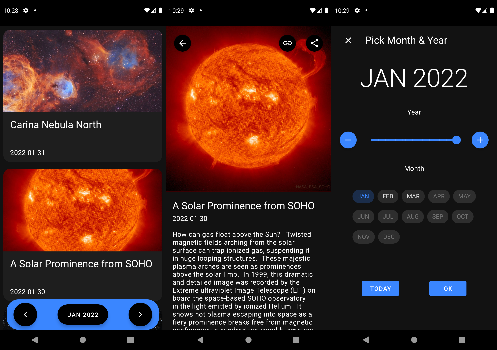
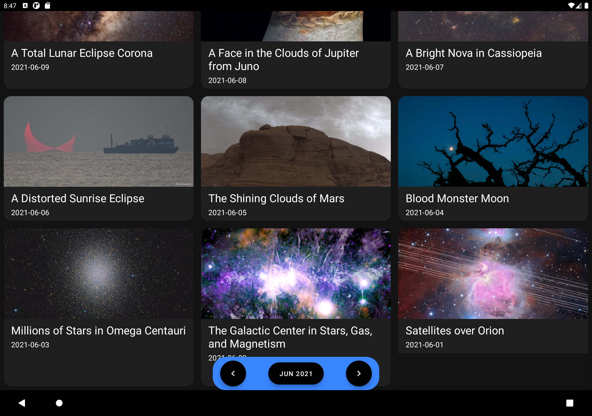

# Astronomy Picture of the Day + Kotlin + Material Design (APODKTM)



[](https://opensource.org/licenses/Apache-2.0) [](https://github.com/llopisdon/APODKTM/actions/workflows/android.yml)

# About

A sample Android app for viewing the NASA Astronomy Picture of the Day (APOD) archive for each month.

# Download

The latest DEBUG APK can be found here:

[](https://github.com/llopisdon/APODKTM/releases/latest/download/app-debug.apk)

# Screenshots





## The app demonstrates the use of the following technologies:

* Coil
* Hilt
* Jetpack Architecture Components: Lifecycle, Navigation, Room, ViewModel
* Kotlin
* Kotlin Coroutines
* Kotlin Flows
* kotlinx.serialization
* Ktor
* Material Components for Android


# APOD API KEY

The app looks for an APOD api key in this properties file:

```
~/.gradle/gradle.properties
```

The api key property key/value pair should be defined as:

```
apodktm_nasa_apod_api_key=<YOUR API KEY>
```

If an APOD api key is not found then the demo APOD api key is used:

```
DEMO_KEY
```

To generate an APOD api key go here:

https://api.nasa.gov/


# Resources

## NASA APOD

https://apod.nasa.gov/

## NASA APOD Api Reference

https://github.com/nasa/apod-api

## Icon & Place Holder Image

**"Very Large Array, Socorro, United States"**

https://unsplash.com/photos/Wj1D-qiOseE

*By Donald Giannatti*

